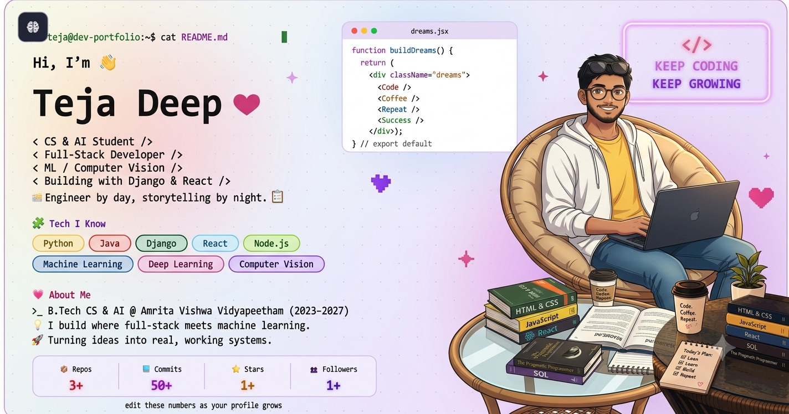

<picture>
  <source media="(prefers-color-scheme: dark)" srcset="./banner.svg?v=1">
  <source media="(prefers-color-scheme: light)" srcset="./banner-light.svg?v=1">
  
</picture>

 

<table>
<tr>
<td width="30%" align="center" valign="top">

</td>
<td width="70%" valign="top">

### 🚀 My Builds

| Project | Tech | Highlights |
|---|---|---|
| [Smart Attendance System](https://github.com/teja981/smart-attendance-system) | `Django` `OpenCV` `Dlib` | Automated attendance via face recognition |
| [AI Fitness Tracker](https://github.com/teja981/AI-FITNESS-TRACKER) | `Pandas` `Scikit-learn` | ML-driven fitness insights |
  PORTIFILO WEBSITE: [portifilo-two-zeta.vercel.app](https://portifilo-two-zeta.vercel.app/)

### 💗 About Me
>_ B.Tech in Computer Science & AI @ Amrita Vishwa Vidyapeetham (2023–2027)
🤖 I build things where full-stack meets machine learning
📈 Turning coursework and side projects into real, working systems

</td>
</tr>
</table>

 

### 🧑‍💻 That's me, mid-sprint

 

 

### 🏆 Trophies

 

### 🐍 Watch the Snake Eat My Contributions

Colors match the banner theme — customize them in <code>.github/workflows/github-snake.yml</code>.

  

### 📬 Let's Connect

  

⭐ *Always learning, always building.* 💜

